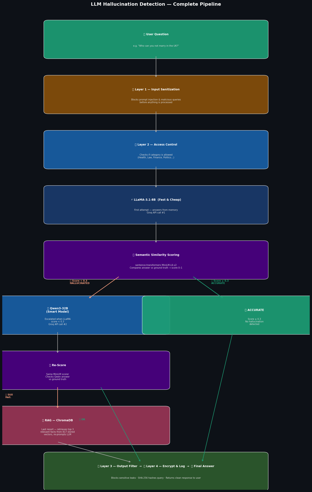

# 🔬 LLM Hallucination Detection Pipeline

> A self-healing LLM evaluation system that detects hallucinations in real time, escalates across models, and auto-corrects using RAG — with 4 security layers built in.

---

## 🗂️ Project Structure
LLM-HALLUCINATION-EVALUATION/
│
├── 📁 v1-pipeline/
│   ├── Hallucinate.ipynb              # Benchmarking pipeline
│   └── hallucination_full_analysis.png # Results chart
│
├── 📁 v2-rag-langgraph/
│   ├── LangraphSelfHealing.ipynb      # RAG + LangGraph agent
│   └── pipeline_full.png              # System architecture diagram
│
└── README.md

---

## 🧠 System Architecture

---

## 📦 V1 — Benchmarking Pipeline

**What it does:**
- Loads TruthfulQA dataset (817 questions, 6 categories) from HuggingFace
- Queries LLaMA-3.1-8B and Qwen3-32B via Groq API
- Scores answers using semantic similarity (sentence-transformers)
- Generates hallucination rate report by topic category

**Key Finding:**

| Category | LLaMA-3.1-8B | Qwen3-32B |
|---|---|---|
| Finance | 0% | 0% |
| Health | 0% | 0% |
| Science | 0% | 0% |
| Politics | 0% | 0% |
| Misconceptions | 0% | 0% |
| **Law** | **20%** | **20%** |

---

## 🤖 V2 — Self-Healing RAG + LangGraph Agent

**What it does:**
- Builds ChromaDB vector store from all 817 TruthfulQA ground truth answers
- LangGraph agent detects hallucinations in real time
- Cascades across models: LLaMA → Qwen3 → RAG
- Auto-corrects wrong answers using retrieved facts
- 4 security layers protect the entire pipeline

**Cascade Flow:**

Question
↓
⚡ LLaMA-3.1-8B (fast, cheap)
↓
hallucinated? → 🧠 Qwen3-32B (smarter)
↓
hallucinated? → 🔍 RAG ChromaDB (last resort)
↓
✅ Final Answer

**4 Security Layers:**
- 🔒 Layer 1 — Input Sanitization (blocks prompt injection)
- 🔑 Layer 2 — Access Control (category allowlist)
- 🛡️ Layer 3 — Output Filtering (blocks sensitive leaks)
- 🔐 Layer 4 — Encryption (SHA-256 query logging)

---

## 🛠️ Tech Stack

| Layer | Tool |
|---|---|
| Dataset | TruthfulQA (HuggingFace) |
| LLM API | Groq (free tier) |
| Model 1 | LLaMA-3.1-8B-Instant |
| Model 2 | Qwen3-32B |
| Vector DB | ChromaDB |
| RAG | LangChain + LangGraph |
| Scoring | sentence-transformers |
| Visualisation | matplotlib, seaborn |
| Environment | Google Colab |

---

## 🚀 How to Run

### V1 — Benchmarking
1. Open `v1-pipeline/Hallucinate.ipynb` in Google Colab
2. Add Groq API key to Colab Secrets as `Groq`
3. Run all cells

### V2 — Self-Healing Agent
1. Open `v2-rag-langgraph/LangraphSelfHealing.ipynb` in Google Colab
2. Add Groq API key to Colab Secrets as `Groq`
3. Run all cells

---

## 🔮 Roadmap

- [x] V1 — Benchmarking pipeline
- [x] V2 — RAG + LangGraph self-healing agent
- [ ] V3 — Streamlit frontend
- [ ] V4 — Docker deployment
- [ ] V5 — Scale to full 817 questions

---

## 👤 Author

**Sabyasachi Ghosh**
- GitHub: [@sabyg147](https://github.com/sabyg147)

---

